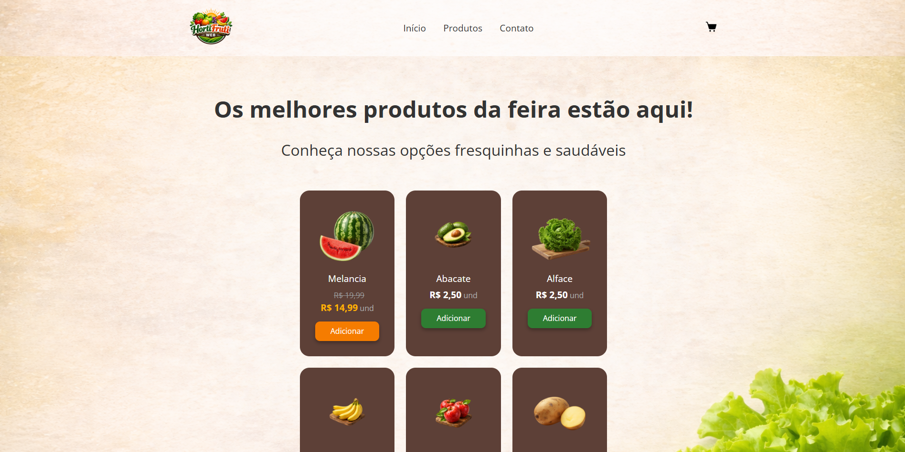
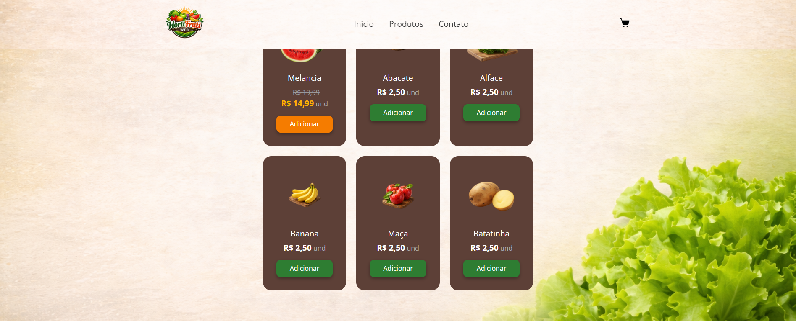
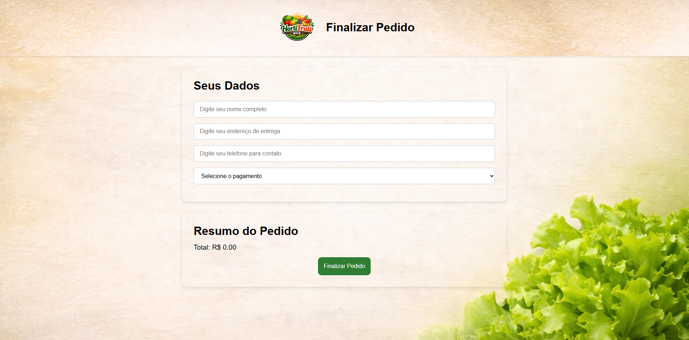
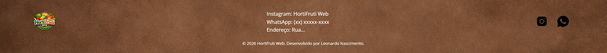

<h1 align="center">🥬 HortiFruti Web</h1>

  Interface de um site de hortifruti com foco em design moderno, responsividade e experiência do usuário.

---

## 🚀 Sobre o projeto

O **HortiFruti Web** é um projeto front-end desenvolvido com o objetivo de simular uma aplicação real de e-commerce de frutas, verduras e legumes.

Durante o desenvolvimento, o foco foi evoluir não apenas o design, mas também a estrutura do código, responsividade e organização seguindo boas práticas de desenvolvimento front-end.

---

## ✨ Funcionalidades

- 🧭 Navegação entre seções (Início, Produtos, Contato)
- 🛍️ Listagem de produtos em layout de cards
- 💰 Destaque de produtos em promoção
- 🛒 Página de carrinho de compras
- ➕ Adição de produtos ao carrinho
- 📱 Layout responsivo (desktop, notebook e mobile)
- 🎨 Interface moderna com foco em experiência do usuário

---

## 🖼️ Preview do projeto

### 🏠 Página inicial
Destaque visual com banner e chamada principal:

### 🛒 Seção de produtos
Produtos organizados em cards com preço e botão de ação:

### 🛍️ Carrinho
Interface para visualização dos produtos adicionados:

### 🧾 Footer
Área com informações de contato e redes sociais:

---

## 🛠️ Tecnologias utilizadas

- HTML5  
- CSS3

---

## 🎯 Aprendizados

Este projeto foi fundamental para praticar e evoluir em:

- Estruturação semântica com HTML
- Estilização com CSS (Flexbox e Grid)
- Responsividade (media queries para diferentes telas)
- Organização de código e boas práticas 
- Experiência do usuário (UX)

---

## 📈 Próximos passos

- Implementar do JAVASCRIPT no Carrinho e Finalizar Pedidos WhatsApp

---

## 🧑‍💻 Autor

Feito por **Leonardo Nascimento** 🚀