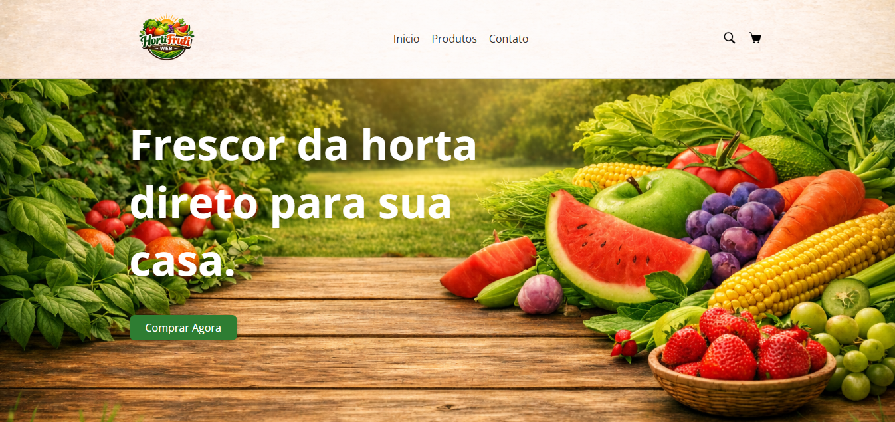

<h1 align="center">🥬 HortiFruti Web</h1>

  Interface de um site de hortifruti com foco em design moderno, organização e experiência visual.

---

## 🚀 Sobre o projeto

O **HortiFruti Web** é um projeto front-end desenvolvido com o objetivo de simular a interface de uma loja online de frutas, verduras e legumes.

O foco principal deste projeto foi a criação de um layout atrativo, organizado e inspirado em aplicações reais.

---

## ✨ Funcionalidades

- 🧭 Navegação simples (Início, Produtos, Contato)
- 🛍️ Exibição de produtos com imagens e preços
- 💰 Destaque de promoções
- 🎨 Design moderno com cores temáticas (hortifruti)
- 📱 Estrutura preparada para responsividade
- 🔍 Ícones visuais (busca e carrinho)

---

## 🖼️ Preview do projeto

### 🏠 Página inicial
Destaque visual com banner e chamada principal:

### 🛒 Seção de produtos
Produtos organizados em cards com preço e botão de ação:

### 🧾 Footer
Área com informações de contato e redes sociais:

---

## 🛠️ Tecnologias utilizadas

- HTML5  
- CSS3  

---

## 🎯 Objetivo

Este projeto foi desenvolvido para praticar:

- Estruturação de páginas com HTML
- Estilização com CSS
- Organização visual de componentes
- Criação de interfaces mais profissionais

---

## 🧑‍💻 Autor

Feito por **Leonardo Nascimento** 🚀
